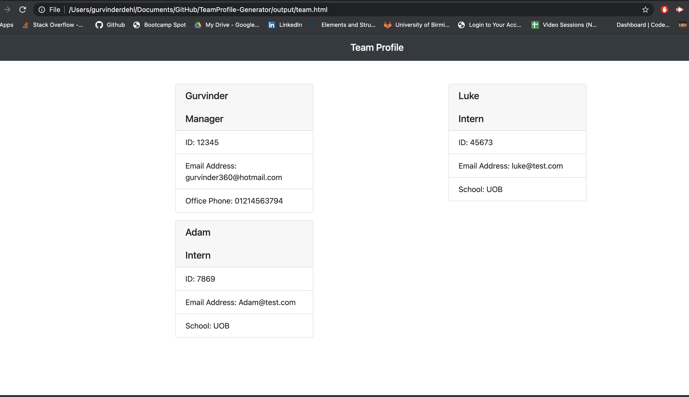

# TeamProfile-Generator
#### Table of Contents
1. [Project Description](#project-description)
2. [Installation Instructions](#installation-instructions)
3. [Usage Information](#usage-information)
4. [Contributors](#contributors)
5. [Instructions](#Instructions)
6. [License](#license)
7. [Questions](#questions)
## Project Description
* The purpose of this project, is to generate a Team profile html file, which can be used to display the members of a team. 
## Installation Instructions
* The user will need to run NPM init to initialise the application, once this has been done. The user will then install inquirer through the use of npm install inquirer and then they will also install jest by running the following command npm install jest. Therefore when using the application all of the dependancies are installed, once this is done the user will need to run the file by using node index.js, which will be show below in the demonstration. 

After the application has been run and the output html file has been created, the user can then use npm run test to run the tests file, which all should pass, successfully.
## Usage Information
* The use of this application is to generate Team Profile file, for anyone using the application.
## Contributors
* There are no Contributors for this Project.
## Instructions
* Instructions will be shown below in a video :

## License
* licensed under the [MIT License](LICENSE)
## Questions
* For additional help or questions, please reach out to gurvinder360@hotmail.com
* Follow me on Github at [gurvinderdehl](http://github.com/gurvinderdehl)

## URLs 

* The URL of the video demonstrating the application : https://drive.google.com/file/d/12oPrngEXBmeKkk1dUXDshqGFdAaMmEex/view?usp=sharing
* The URL of the GitHub repository: https://github.com/gurvinderdehl/TeamProfile-Generator